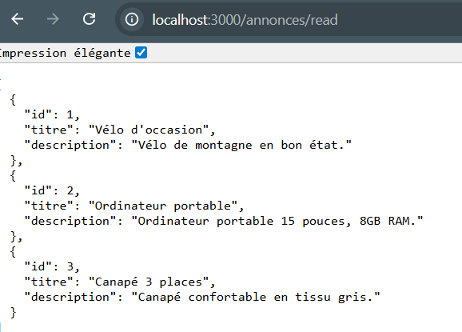
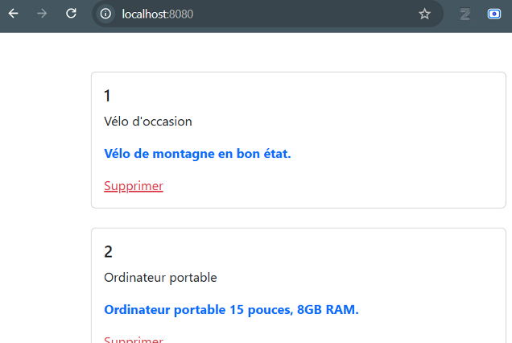

# Exercice — Prise en main de l'application "Petites annonces"
**Sujet** (module **324**) : Nodejs et application multi-tiers

**Resources** : Les sources fournies dans ce répertoire

**Modalité** : Individuel

---
## Objectifs
- Rappel sur l'architecture client/serveur avec nodejs vue lors des modules 294 et 295.
- Utilisation de Docker pour l'environnement de développement local.

---
## Contexte
Le code source d'une application de gestion des petites annonces vous est fourni. Il s'agit de faire fonctionner cette application sur votre poste local au moyen de conteneurs Docker. 

---
## Consigne
Définissez trois conteneurs Docker pour cette application :
1. Un conteneur pour le backend.
2. Un conteneur pour le frontend
3. Un conteneur avec la base de données MySQL. 

Utilisez docker-compose pour cela !

## Les étapes
Création du fichier **Dockerfile** pour le backend :
- Créez le fichier *Dockerfile* dans le répertoire */backend*.
- Cette image sera basée sur l'image Docker *node:18-alpine*.
- Copiez le fichier package.json sur l'image.
- Exécutez la commande *npm install*.
- Copiez tous les fichier sur le conteneur (attention à avoir définir le répertoire de travail à */usr/src/app*).
- Définissez les commandes démmarage *node ./src/server.js*

Tester le build et le run de l'image !

*Pour tester :*
``` shell
docker build -t petitesannonces-backend .
docker run -p 3000:3000 petitesannonces-backend
```

Création du fichier **Dockerfile** pour le frontend :
- Créez le fichier *Dockerfile* dans le répertoire */frontend*.
- Cette image sera basée sur l'image Docker *nginx:alpine*.
- Copiez tous les fichiers dans le répertoire */usr/share/nginx/html* de l'image Docker.

Création du fichier **docker-compose.yml** qui contiendra le serveur frontend, le serveur backend et le serveur MySQL.
- Créez le fichier docker-compose.yml à la racine du projet.
- Déclarez un service backend avec les éléments suivants :
    -  Faites référence au build Docker qui se trouve sur ./backend.
    - Mappez le port 3000 sur le port local 3000.
- Déclarez un service db avec les éléments suivants :
    - Le service est basé sur l'image mysql:8.0.
    - Mappez le port 3006 sur le port local 3006.
    - Déclarez un volume pour mapper *db_data:/var/lib/data*. Le volume db_data est à définir à la fin du fichier.
    - Déclarez un volume pour mapper *./db/init_db.sql:/docker-entrypoint-initdb.d/init_db.sql:ro*. Cela permettra d'initialiser automatiquement la base de données !
- Pour ces deux services, vous aurez besoin des variables d'environnement listées ci-dessous. Dans un premier temps, nous mettrons les valeurs de ces variables directement dans le fichier YML mais nous verrons plus tard comment éviter cela.
    - MYSQL_DATABASE: db_annonces
    - MYSQL_USER: appuser
    - MYSQL_PASSWORD: userpwd
- De plus, pour le service backend, vous aurez encore besoin de la variable d'environnement :
    - MYSQL_HOST: db
- Et pour le service db, vous aurez encore besoin de la variable d'environnement :
    - MYSQL_ROOT_PASSWORD: rootpassword
- Déclarez encore un service frontend avec les éléments suivants :
    - Faites référence au build Docker qui se trouve sur *./frontend*
    - Mapper le port 8080 sur le port local 80

Vous pouvez démarrer le service (commande docker-compose up) et, si tout va bien, vous devriez pouvoir accéder au backend :


Testez ensuite le frontend :

